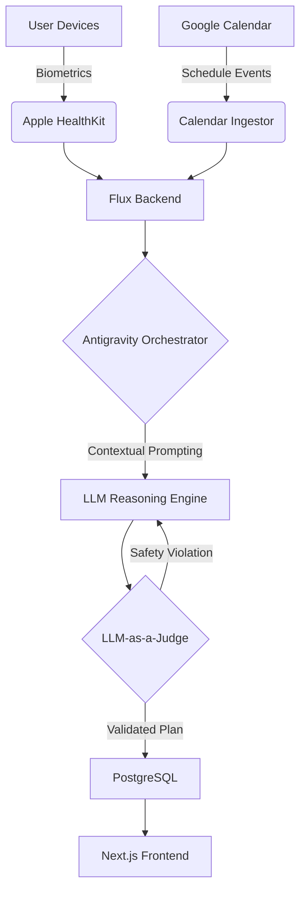

# Flux | Technical Architecture

This document outlines the system design and data orchestration of **Flux**. The architecture is designed to handle highly volatile real-time data (Calendars/Biometrics) while ensuring plan integrity through an agentic reasoning layer.

## 1. System Overview

Flux utilizes a modular architecture to separate data ingestion, AI-driven reasoning, and user delivery.

* **Frontend:** Next.js (App Router) for a responsive, mobile-first interface.
* **Backend:** Next.js Server Actions and API Routes.
* **Orchestration:** Antigravity for managing agentic reasoning chains.
* **Database:** PostgreSQL for persistent storage of training plans, user state, and adaptation logs.
* **Data Sources:** Apple Health (via HealthKit) and Google Calendar API.

## 2. High-Level Data Flow

The system processes data through a continuous optimization loop:

1.  **Ingestion:** Biometric data is pulled from Apple HealthKit and schedule events are pulled from the Google Calendar API.
2.  **Processing:** The Flux backend sends this raw data to the Antigravity Orchestrator.
3.  **Reasoning:** The orchestrator uses contextual prompting to engage the LLM Reasoning Engine.
4.  **Validation:** The proposed plan is sent to the LLM-as-a-Judge layer for safety and sports-science verification.
5.  **Persistence:** Once validated, the plan is stored in PostgreSQL.
6.  **Delivery:** The updated training plan is served to the Next.js frontend for the user.

## 3. Component Breakdown

### 3.1 The Reasoning Engine (Antigravity)
Flux moves beyond "one-shot" prompting. Using Antigravity, the system treats plan generation as an agentic loop rather than a static response:
* **Context Assembly:** Aggregates current training goals, the last 7 days of biometrics, and the next 48 hours of calendar events.
* **Constraint Mapping:** Translates sports science principles (e.g., "Do not increase weekly load >10%") into system instructions.
* **Plan Synthesis:** Generates a tactical workout adjustment based on the intersection of physical readiness and time availability.

### 3.2 Evaluation Layer (LLM-as-a-Judge)
To prevent "hallucinated overtraining" (e.g., the AI suggesting a high-intensity interval session following a night of 4 hours of sleep), Flux implements a dual-model evaluation framework:
* **Generator Model:** Proposes the initial workout shift or adjustment.
* **Judge Model:** Evaluates the proposal against a strict set of safety and physiological benchmarks. If the judge rejects the plan, the Generator is re-prompted with the specific violation for correction.

### 3.3 Data Ingestion & Synthesis
* **Apple HealthKit:** Flux prioritizes passive data collection. By polling HealthKit for Heart Rate Variability (HRV) and Sleep scores, the system calculates a daily "Readiness Score" without requiring manual user entry.
* **Google Calendar API:** Flux monitors for specific event types (e.g., "Out of Office," "Flight," or late-night meetings) to trigger the reactive rescheduling logic.

### 3.4 Persistence Layer
PostgreSQL serves as the system's long-term memory, storing:
* **The Baseline Plan:** The primary objective (e.g., a 12-week marathon block).
* **The Adaptive Log:** A record of every AI-driven change, used to fine-tune the Generator's understanding of user preferences and adherence patterns over time.

## 4. Development Strategy

The project was developed using an AI-native workflow, prioritizing high-velocity iteration and technical agency.

* **AI-Native Pair Programming (Cursor):** Utilized Cursor to accelerate the "inner loop" of development. This allowed for rapid refactoring of the adaptive logic and the data schema as user feedback and performance simulations evolved.
* **Type Safety & Reliability:** Leveraged TypeScript across the full stack to ensure that complex biometric payloads (HRV, sleep scores, etc.) are handled consistently from the ingestion layer through the Antigravity orchestrator to the LLM prompt.
* **Architecture Validation:** Utilized AI-assisted prototyping to simulate high-load calendar scenarios and validate the "Judge" model's rejection logic. This ensured the system could handle edge cases—such as overlapping flights or extreme fatigue scores—before the frontend implementation was finalized.
* **Product-Led Iteration:** The development roadmap was driven by a comprehensive PRD, ensuring that every technical decision (e.g., choosing Antigravity for orchestration) was directly tied to the core user objective: maintaining long-term training consistency.
